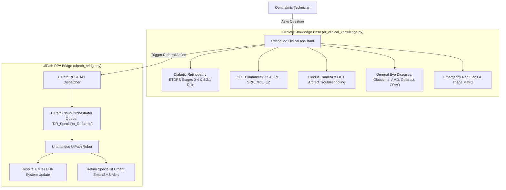

# 🤖 UiPath-Powered Diabetic Retinopathy Technician Chatbot
### Complete Integration Guide & Hackathon Blueprint

---

## 🌟 Overview

In eye care screening camps and tele-ophthalmology clinics, **technicians** are on the front lines capturing fundus photographs and OCT scans. They constantly face:
1. **Clinical Questions**:
   - What are the diagnostic criteria for Severe NPDR vs PDR?
   - What does Intraretinal Fluid (IRF) or Subretinal Fluid (SRF) indicate on an OCT raster scan?
   - How do I distinguish drusen in AMD from hard exudates in Diabetic Retinopathy?
2. **Camera & Imaging Artifacts**:
   - How to eliminate white corneal glare reflections?
   - What to do when a patient has poor pupil dilation or cataract haze?
3. **Workflow & EMR Bottlenecks**:
   - When a patient has sight-threatening disease, how to quickly alert retinal specialists and enter the data into hospital EMRs without filling out slow paperwork.

This chatbot is a **dedicated, lightweight, and modular clinical co-pilot** that answers technician questions accurately and connects to **UiPath Orchestrator** to trigger robotic process automation (RPA) workflows.

---

## 🏗️ Architecture



---

## 🚀 How to Run the Chatbot

From PowerShell or Command Prompt:
```powershell
cd "c:\Users\monis\OneDrive\Desktop\fundus_gradcam_app"
.\venv\Scripts\streamlit.exe run app.py
```
Open **`http://localhost:8501`** in your browser.

---

## 🔌 How to Combine This Chatbot Into Your Existing Web App

The chatbot was built to be **100% modular**. You can integrate it into any existing Python web app in just 2 lines!

### In Streamlit:
```python
from chatbot_ui import render_technician_chatbot

# In any tab, sidebar, or section of your web app:
render_technician_chatbot()
```

### In Flask / FastAPI / React (via REST or headless):
```python
from dr_clinical_knowledge import ClinicalEyeAssistant
from uipath_bridge import UiPathBridge

assistant = ClinicalEyeAssistant()
bridge = UiPathBridge()

# 1. Answer any technician question:
answer = assistant.answer_query("How do I fix corneal glare on my fundus camera?")

# 2. Dispatch a referral to UiPath:
result = bridge.dispatch_referral_to_uipath(
    patient_id="MRN-10293",
    predicted_condition="Severe NPDR (4:2:1 Rule)",
    confidence_pct=92.5,
    urgency="Urgent Specialist Consult (2-4 Weeks)",
    technician_notes="Exudates and blot hemorrhages observed."
)
```

---

## ⚙️ UiPath Cloud Orchestrator Setup

### 1. Zero-Setup Demo Mode (Default)
During your hackathon demo, if you don't have internet or haven't configured cloud keys yet, **RetinaBot automatically runs in Resilient Hackathon Demo Mode**. It generates realistic transaction IDs (`UIPATH-TX-XXXXXXXX`), simulates robot execution logs, and shows the exact JSON payload.

### 2. Live UiPath Cloud Connection
To connect directly to your live UiPath Automation Cloud tenant:
1. Log into [cloud.uipath.com](https://cloud.uipath.com).
2. Go to **Orchestrator** ➔ **Queues** ➔ Create a queue named `DR_Specialist_Referrals`.
3. Set your environment variables in PowerShell:
   ```powershell
   $env:UIPATH_ORG_NAME="your-org-name"
   $env:UIPATH_TENANT_NAME="DefaultTenant"
   $env:UIPATH_BEARER_TOKEN="your-oauth2-bearer-token"
   ```

### 3. Payload Format Consumed by the UiPath Robot:
```json
{
  "itemData": {
    "Name": "DR_Specialist_Referrals",
    "Priority": "High",
    "SpecificContent": {
      "TransactionID": "UIPATH-TX-123A3052",
      "PatientMRN": "MRN-2026-8412",
      "PredictedCondition": "Severe NPDR (4:2:1 Rule)",
      "ConfidencePercentage": "93.0%",
      "UrgencyWindow": "Urgent Specialist Consult (2-4 Weeks)",
      "OCTBiomarkers": ["Unspecified"],
      "TechnicianNotes": "Suspected center-involving macular edema and extensive intraretinal hemorrhages.",
      "OnCallSpecialistEmail": "retina.oncall@sih-hospital.org",
      "SourceSystem": "Diabetic Retinopathy Screening Assistant",
      "SubmissionTime": "2026-09-28 20:21:40"
    }
  }
}
```

---

## 🎤 Hackathon Pitch Talking Points

1. **Addresses the Screener's Reality**: Most rural screening camps are run by technicians, not retinal surgeons. Technicians need an immediate clinical guide to answer questions about DR grading and troubleshooting camera artifacts on the spot.
2. **End-to-End Automation with UiPath**: Instead of stopping at answering questions, the chatbot allows technicians to trigger unattended UiPath robots that enter patient referrals into the hospital EMR, closing the gap between screening and patient treatment.
